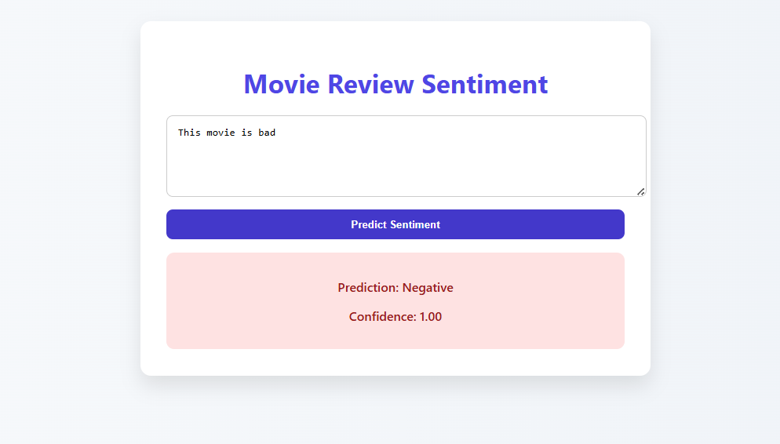

# mini-project

A lightweight machine learning pipeline for predicting sentiment (positive or negative) from movie reviews using Logistic Regression and TF-IDF. Built with `scikit-learn`, deployed with `FastAPI`, and tracked using `DVC`.

## Overview

This project processes IMDb-style review data, cleans and vectorizes the text, trains a Logistic Regression classifier, and serves predictions via a FastAPI web UI.

## Tools Used

| Tool         | Purpose                                 |
| ------------ | --------------------------------------- |
| DVC          | For handling data                       |
| Pandas       | For data analysis                       |
| matplotlib   | For visualization                       |
| Seaborn      | For enhancing matplotlib visualizations |
| Numpy        | For numerical operations                |
| Scikit-learn | For machine learning                    |
| FastAPI      | For exposing predictions via an API     |
| Joblib       | For model serialization                 |

## Installation

Clone the repository and install dependencies:

```bash
git clone https://github.com/your-username/mini-project.git
cd mini-project
pip install -r requirements.txt
```

## How to run the fastapi app

```bash
cd app
uvicorn main:app --reload
```

Then open your browser and go to: http://127.0.0.1:8000

Submit a review via the UI and get an instant prediction.




## How to run the command-line prediction script

```bash
python scripts/predict.py "Your movie review here"
```

## Contributor

- **Tinsae Shemalise**
